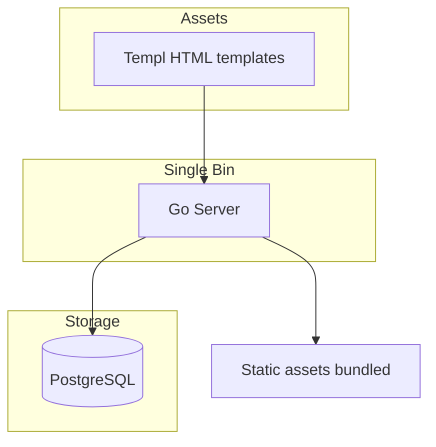
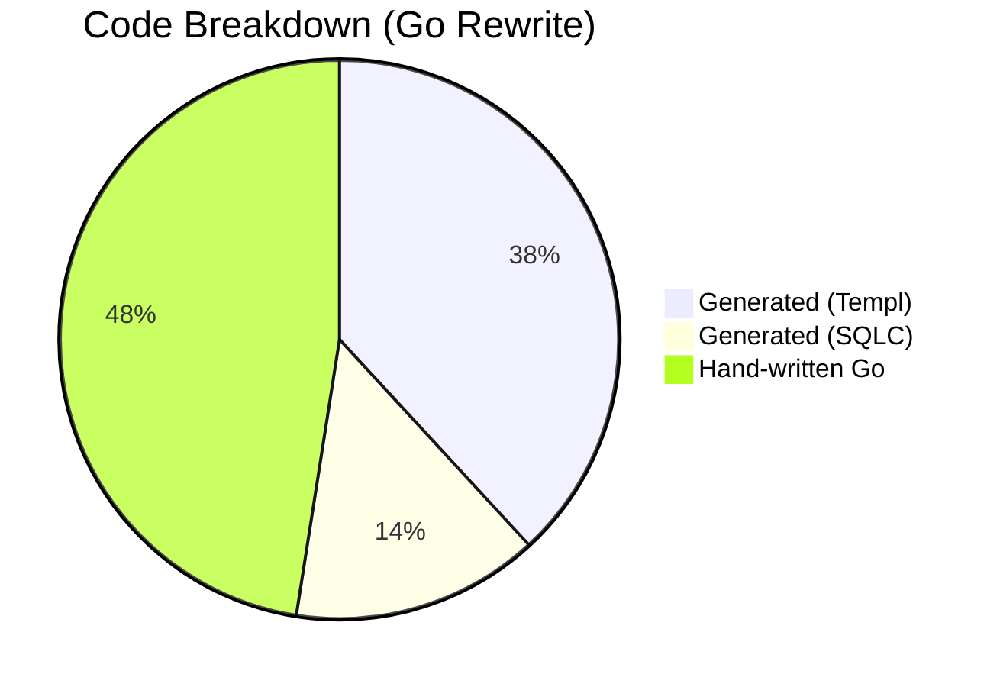
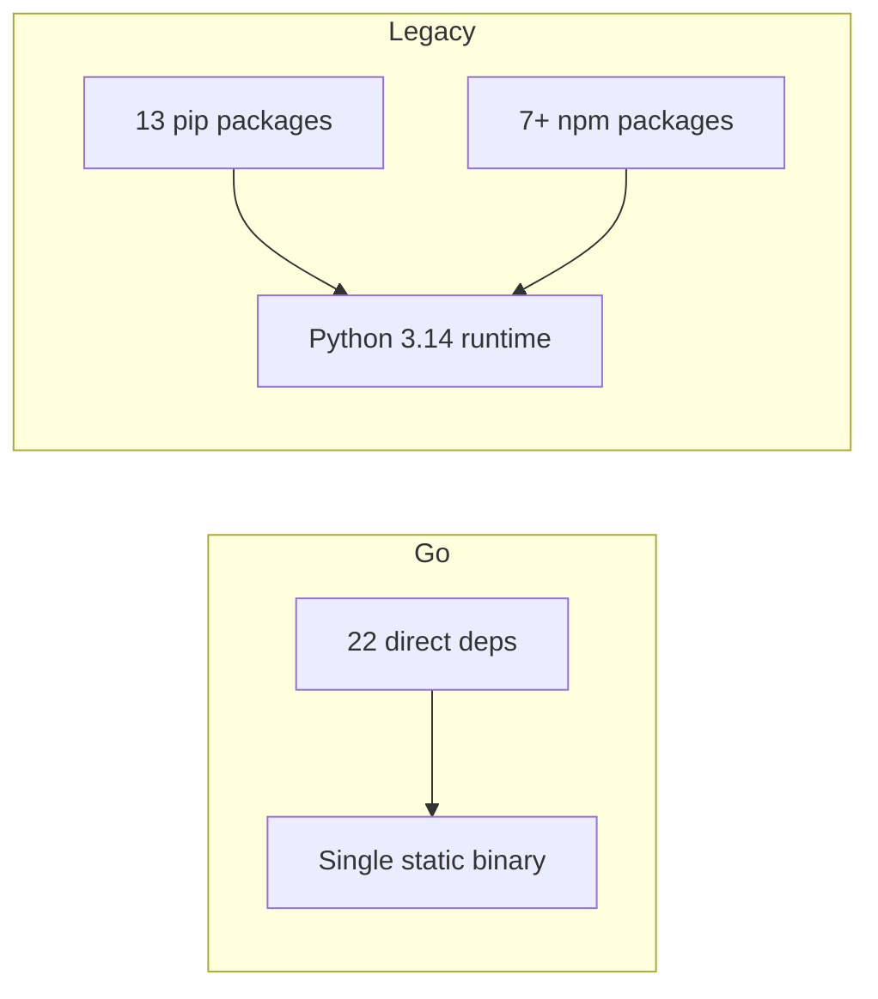
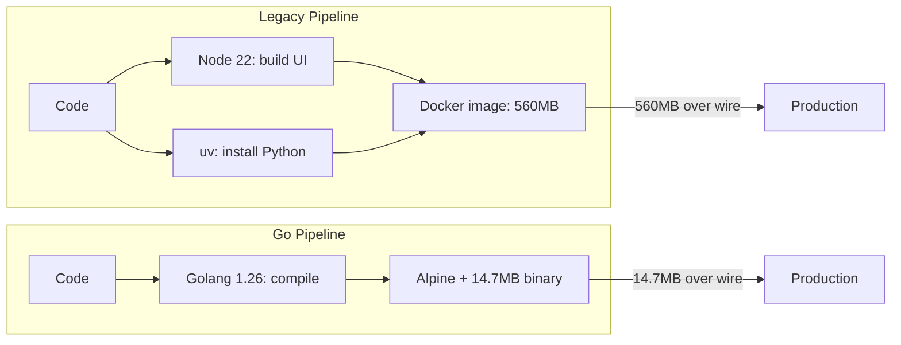

## Why Rewrite Julython?

Julython started in 2012 as a Python application with a React frontend. Over 14 years, it grew organically — new features were bolted on, technical debt accumulated, and the codebase became harder to navigate. In 2026, we decided it was time for a rewrite.

We chose Go for several reasons:

- **Simplicity**: One language, one binary, no build steps required for the runtime
- **Performance**: Compiled, statically typed, with excellent concurrency support
- **Deployment**: A single static binary on Alpine Linux — no Python runtime, no node, no 43 pip packages
- **Developer experience**: Fast compile times, excellent tooling, clear project structure

But numbers tell the story better than prose. Let's look at the comparison.

## Architecture Comparison

First, let's look at how the two versions are structured.

### Legacy (Python + React)

### Go Rewrite

The key difference: **two runtimes vs one**. The legacy app needs both a Python runtime and a Node.js build pipeline. The Go version is a single binary.

## By the Numbers

| Metric | Go (main) | Legacy (Python + React) |
|---|---|---|
| Source files | 137 Go files | 28 Python + 64 TS/JS = 92 |
| Lines of code | ~31,106 | ~17,927 |
| Direct runtime deps | 22 | 20 (13 pip + 7 npm) |
| Total deps (incl. indirect) | 83 | 43 pip + many npm |
| Binary / image size | 37 MB binary | Python 3.14 + 43 pip + build artifacts |
| Docker image (runtime) | 14.7 MB | 560 MB |
| Data transferred on spin-up | 14.7 MB | 560 MB |

At first glance, 31K vs 18K LOC might seem like a step backward. But there's a critical nuance.

## Generated vs Hand-Written Code

~52% of Go LOC is auto-generated by build tools (templ and SQLC).

| Category | LOC | % of total |
|---|---|---|
| Templ generated (`*_templ.go`) | ~8,767 | ~28% |
| SQLC generated (`*.sql.go`) | ~3,293 | ~11% |
| Hand-written Go | ~10,923 | ~35% |
| Test files | ~8,123 | ~26% |
| **Total** | **~31,106** | **100%** |

For comparison, the legacy codebase has no code generation — all 17,927 LOC is hand-written.

But here's the real insight: **hand-written Go is 39% less** than the legacy codebase (10,923 vs 17,927). The generated code isn't something we maintain — it's derived from our templ definitions and SQL queries. Every time we run `make generate`, it rebuilds from source of truth.

## Dependency Comparison

One of the most impactful changes is the reduction in runtime dependencies.

**What this means in practice:**

- **Security surface**: 22 direct deps vs 43+ pip + npm packages
- **Supply chain**: Far fewer third-party packages to audit and maintain
- **Security audit**: 22 packages to review vs 60+ in the legacy stack
- **Vulnerability surface**: Fewer packages = fewer CVEs to track and patch

## Deployment Simplified

### The deployment win: 560 MB → 14.7 MB

| Deployment aspect | Legacy (Python + React) | Go rewrite |
|---|---|---|
| Docker image size (runtime) | 560 MB | 14.7 MB |
| Data transferred on spin-up | 560 MB | 14.7 MB |
| Spin-up speed | Slow (560 MB download) | Near-instant (14.7 MB download) |
| Base images | node:22-alpine + uv:python3.14-trixie | golang:1.26-alpine + alpine:3.20 |
| Build steps | Node build + Python install | Compile → single binary |
| Runtime dependencies | Python 3.14, uv, venv, 43 pip packages | None — single static binary |

The legacy pipeline requires:
1. A Node.js build step for the frontend
2. A Python virtual environment with 43 packages
3. Two base images (node:22-alpine + uv:python3.14-trixie)
4. Download 560 MB of data every time a container spins up

The Go pipeline is simply:
1. Compile → single binary
2. Copy binary + assets into Alpine
3. Download 14.7 MB — **38× less data transferred**

## Key Takeaways

1. **More total code, but less to maintain**: 31K vs 18K total LOC, but only 11K is hand-written Go vs 18K legacy — a 39% reduction in hand-written code.

2. **Half is generated (and that's the point)**: Templ and SQLC generate boilerplate from our templates and queries. This is *more* maintainable because the source of truth is the template/query, not the generated output.

3. **Dependencies halved**: 22 direct runtime deps vs 20+ (13 pip + 7 npm) plus 43 indirect pip packages.

4. **One language, one binary**: No more choosing between Python and TypeScript. No more `npm install` and `pip install`. Deploy one file.

5. **Faster builds, simpler CI**: The Go build is fast, deterministic, and produces a reproducible binary. No node_modules, no wheel cache, no virtualenv conflicts.

6. **38× smaller deployment footprint**: 560 MB Python image → 14.7 MB Go binary. Containers spin up nearly instantly because there's 38× less data to transfer over the wire. This is a game-changer for deployment velocity, CI/CD pipelines, and infrastructure costs.

## The human cost of 14 years of Python + React

The legacy codebase is a story of how software grows organically. Every feature added to a Python/React stack layered on top of the last. By the time you understood how to add a new feature, you needed to know Flask routing, React state management, Vue.js components (yes, some parts migrated to Vue at some point), Node build tools, Python packaging, and PostgreSQL.

The Go rewrite doesn't just change the tech stack — it changes how new developers onboard, how we reason about the system, and how quickly we can ship changes.

---

*Want to dive deeper into any part of the rewrite? Check out the [issue](/issues/160) where this comparison was first drafted, or browse the [main branch](https://github.com/julython/julython.org/tree/main) for the current code.*
