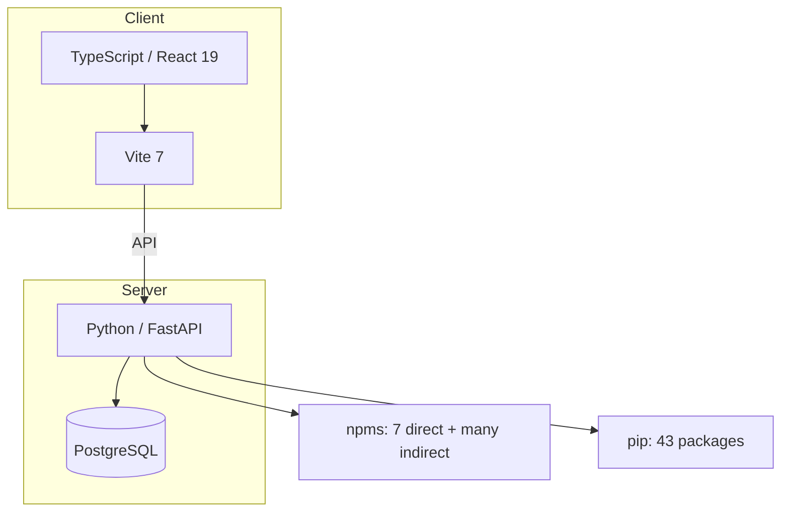
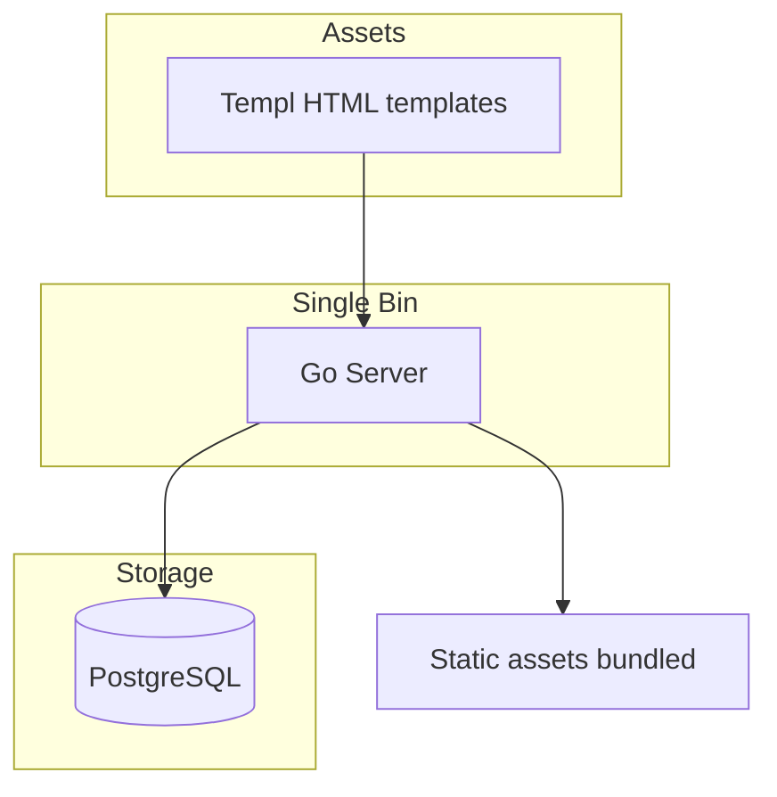
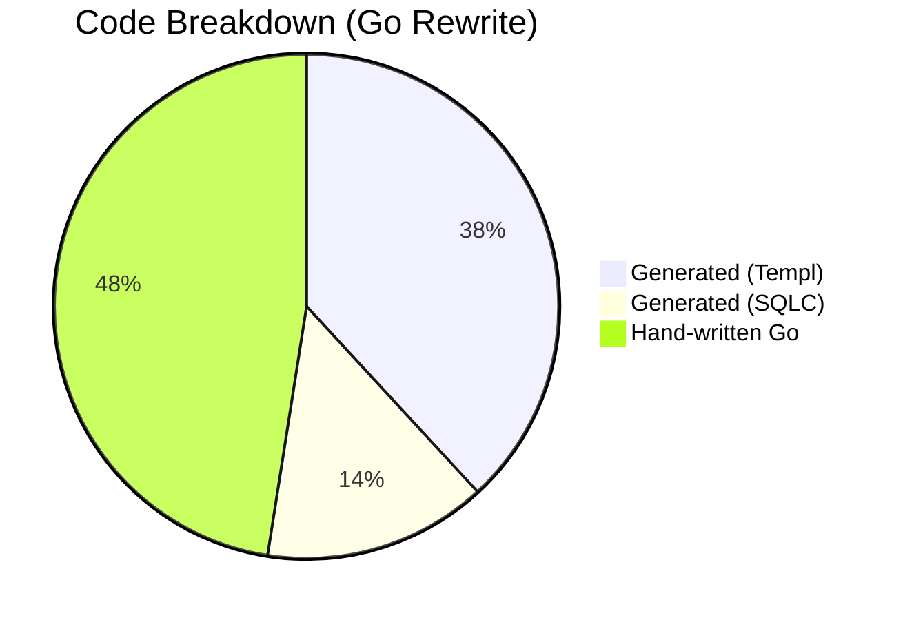
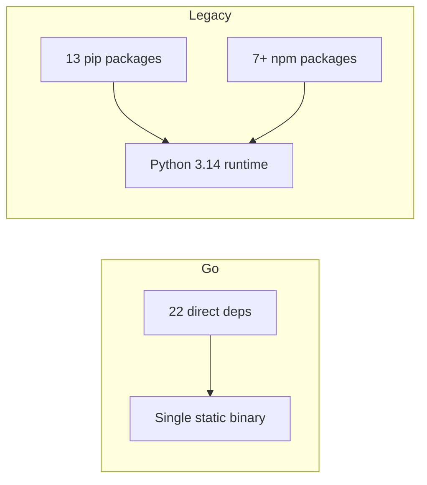
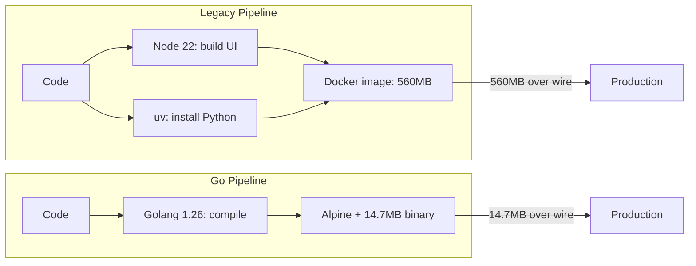

## Why Rewrite Julython?

Julython started in 2012 as a Django application before all these fancy front-end frameworks came on the scene. Through the first couple of years, we saw the front end grow to include Knockout.js and a custom-built version of Nginx to allow us to use WebSockets. Then, around 2017, we sort of stopped working on the site. We wanted to pick it back up, but life got in the way.

Finally, in 2025 at a local meetup, someone brought the idea back up and we decided it had been long enough. In our day jobs, we work with FastAPI and React, so it was the simpler choice when we set out to rewrite the site in our favorite web stack. We got it 'working' well enough for Janulython 2026, but it was not 100% functional for a real game.

The performance in serverless was not great. In order to make the site work, we kept a minimum of 1 node running at all times, which makes 'serverless' more like a constant server. We really didn't want to pay much for this site to run, as it is meant to be fun, not a chore.

A co-worker mentioned his favorite tool for database access—it is called 'sqlc,' but it is only available for Go. After a bit of discussion about the recent changes to Go, we thought we should try rewriting Julython in Go to see how it could work.

Some key features that aligned with our vision:

- **Batteries Included**: Like Python, Go has many tools built into the language, but unlike Python, many of them are actually recommended for production.
- **Performance**: We love using type hints in Python, but in Go they actually have real meaning. This allows the compiler to optimize the binary for speed.
- **Simplicity**: One language, one binary, and a simple build step for the runtime. Not only fast, but super easy to deploy and configure.
- **SQLC**: This is an amazing tool that converts raw SQL queries into Go functions, allowing you to write efficient queries without mastering an ORM SDK.
- **Templ**: This is another amazing tool that allows you to write simple components that look a lot like a React component, but they compile to pure Go.
- **Minimal Dependencies**: Far fewer Go libraries are required to make the site fully functional, meaning less package maintenance.
- **Developer experience**: Fast compile times, excellent tooling, clear project structure.

Oh yeah, and with AI today you can easily transpile the Python code to Go. We tried really hard not to use Frontier models while doing this rewrite, just to prove it could be done with open-source models and local LLMs. We got our hands on a Mac Mini with 64 GB of RAM, and that really made a big difference. Much of the site was written with `pi` and `Qwen3.6-35B-A3B`.

But numbers tell the story better than prose. Let's look at the comparison.

## Architecture Comparison

First, let's look at how the two versions are structured.

### Legacy (Python + React)

### Go Rewrite

The key difference: **two runtimes vs one**. The legacy app needs both a Python runtime and a Node.js build pipeline. The Go version is a single binary.

## By the Numbers

| Metric                      | Go (main)    | Legacy (Python + React)                |
| --------------------------- | ------------ | -------------------------------------- |
| Source files                | 137 Go files | 28 Python + 64 TS/JS = 92              |
| Lines of code               | ~31,106      | ~17,927                                |
| Direct runtime deps         | 22           | 20 (13 pip + 7 npm)                    |
| Total deps (incl. indirect) | 83           | 43 pip + 618 npm                       |
| Binary / image size         | 37 MB binary | Python 3.14 + 43 pip + build artifacts |
| Docker image (runtime)      | 14.7 MB      | 560 MB                                 |
| Data transferred on spin-up | 14.7 MB      | 560 MB                                 |
| Cold Start Times            | 500-700 ms   | 8-10 seconds                           |

At first glance, 31K vs 18K LOC might seem like a step backward. Yet much of the code in the Go version is actually generated.

## Generated vs Hand-Written Code

~52% of Go LOC is auto-generated by build tools (Templ and SQLC).

| Category                       | LOC         | % of total |
| ------------------------------ | ----------- | ---------- |
| Templ generated (`*_templ.go`) | ~8,767      | ~28%       |
| SQLC generated (`*.sql.go`)    | ~3,293      | ~11%       |
| Hand-written Go                | ~10,923     | ~35%       |
| Test files                     | ~8,123      | ~26%       |
| **Total**                      | **~31,106** | **100%**   |

On top of that, we were able to complete many features that we didn't add in the FastAPI + React version. The Go version has a histogram of commits on the front page and a completely new scoring system. This was made possible by SQLC, as we could write all the queries exactly how we wanted them to work without having to fight the ORM. Not only could we write the queries; we could mix and match all the ones we needed for the front page and just render them directly into the Templ components.

The closest comparison would be Next.js with React Server Components. Some people might like that better, as then you get a true front-end framework to use. But Next.js build times are no match for Go, and oh yeah, about 800 dependencies.

## Dependency Comparison

One of the most impactful changes is the reduction in runtime dependencies.

**What this means in practice:**

- **Security surface**: 22 direct deps vs 43+ pip + 618 npm packages
- **Supply chain**: Far fewer third-party packages to audit and maintain
- **Security audit**: 22 packages to review vs 60+ in the legacy stack
- **Vulnerability surface**: Fewer packages = fewer CVEs to track and patch

Go really shines here. If you wanted to, you could drop some of those 22 direct deps. You don't technically need to use `Templ`, for example — Go has templating built in. And we chose a few packages to render this blog from markdown files. I'm sure we could trim a few of the Python packages down too, if we really really wanted to. But NPM is basically a CVE minefield with no good way around it, other than to hope your scanning tool works and doesn't actually hack your code.

## Deployment Simplified

### The deployment win: 560 MB → 14.7 MB

| Deployment aspect           | Legacy (Python + React)                | Go rewrite                       |
| --------------------------- | -------------------------------------- | -------------------------------- |
| Docker image size (runtime) | 560 MB                                 | 14.7 MB                          |
| Data transferred on spin-up | 560 MB                                 | 14.7 MB                          |
| Spin-up speed               | Slow (560 MB download)                 | Near-instant (14.7 MB download)  |
| Base images                 | node:22-alpine + uv:python3.14-trixie  | golang:1.26-alpine + alpine:3.20 |
| Build steps                 | Node build + Python install            | Compile → single binary          |
| Runtime dependencies        | Python 3.14, uv, venv, 43 pip packages | None — single static binary      |

The legacy pipeline requires:

1. A Node.js build step for the frontend
2. A Python virtual environment with 43 packages
3. Two base images (node:22-alpine + uv:python3.14-trixie)
4. Download 560 MB of data every time a container spins up

The Go pipeline is simply:

1. Compile → single binary
2. Copy binary + assets into Alpine
3. Download 14.7 MB — **38× less data transferred**

## Key Takeaways

1. **More total code, but less to maintain**: 31K vs 18K total LOC, but only 11K is hand-written Go vs 18K legacy — a 39% reduction in hand-written code.

2. **Half is generated (and that's the point)**: Templ and SQLC generate boilerplate from our templates and queries. This is _more_ maintainable because the source of truth is the template/query, not the generated output.

3. **Dependencies halved**: 22 direct runtime deps vs 20+ (13 pip + 7 npm) plus 43 indirect pip packages.

4. **One language, one binary**: No more choosing between Python and TypeScript. No more `npm install` and `pip install`. Deploy one file.

5. **Faster builds, simpler CI**: The Go build is fast, deterministic, and produces a reproducible binary. No node_modules, no wheel cache, no virtualenv conflicts.

6. **38× smaller deployment footprint**: 560 MB Python image → 14.7 MB Go binary. Containers spin up nearly instantly because there's 38× less data to transfer over the wire. This is a game-changer for deployment velocity, CI/CD pipelines, and infrastructure costs.

## The Final Take

With all software change comes a constant: with all the new tooling and AI improvements, the barrier to rewriting systems in a new language has never been lower. The Go rewrite of Julython proved that you don't need expensive proprietary tools or massive teams to modernize an old codebase. With open-source tools, local LLMs, and a bit of determination, we transformed a 14-year-old Django application into a modern, performant Go application — and the numbers speak for themselves.
