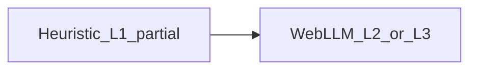

## Scoring History

Julython was started in 2012 and was loosely based on the now defunct National Novel Writing Month, which encourages participants to write 50,000 words to "win". We chose to track scoring by tracking commits via a webhook, giving participants 1 point for each commit and 10 points for a new repo added to the game. This was acceptable as a means to track users, so if you were playing "fairly" it was just for your own personal tracking - a gentle nudge to keep committing each day. While this is very easy to track, it doesn't really fit with the goal of helping people learn or actually ship meaningful code.

## What About AI?

As you know, a lot has changed since 2012 and many people are predicting doom and gloom for the software development industry. While we can't say for certain what day-to-day work will look like, we can say that software development best practices and good software design are now more important than ever - regardless of whether you are physically writing the code yourself.

What does that mean for Julython?

We actually need to get better at design and documentation in order to develop software in this new landscape. In effect, we are getting closer to the problem that NaNoWriMo originally attempted to tackle: you have an idea for a tool or want to get involved in software development, but the path forward is still daunting. Sure, anyone can prompt Claude to "write a first person shooter game" and it may even produce something playable. But it won't be great or easy to maintain. You'll constantly be prompting the LLM to fix things or add features that introduce bugs or break the app entirely.

With our new scoring we attempt to address these issues by tracking the health of your project across a few key metrics. Completing all the metrics won't magically make your software better, but it will help you as you refactor and grow. The only constant in programming is that things always change - so be prepared.

The best analogy for the period we're in: "Civil engineers and architects draw the plans for a new building, then hand it off to a team of workers who actually do the work." The key difference with AI is that labor is incredibly fast and cheap. The cost of writing greenfield software is racing toward zero, but the costs associated with maintaining it have not changed - and left unchecked, will only get worse.

## Why Local LLMs Are the Key

We care a lot about [your privacy](/privacy) and don't want to hand code and IP to "Big Tech". Julython has always been about open source, and that has not changed. AI is evolving rapidly and we hope that much of what currently requires cloud models will soon be possible locally. In fact, our scoring is based on how well a WebLLM model can analyze the code entirely in your browser. We will not download your code or store it on our servers. Julython is community-run and independent - we're doing this because we love it.

## How the Analysis Works

### Level 1 — heuristics (server-side for public GitHub)

For **public** GitHub repositories, **Level 1** is **fast heuristic** scoring (partial credit **0–10** per metric) from checklist-style signals. The **authoritative** run is **server-side** when we receive a **push webhook** on the default branch. You can also **re-scan** from the **project page** (if you own the repo) via the same server-side scan. **Private** repositories are skipped (we persist visibility from the webhook).

**First progress bar:** you only get **L1** (the first tier) when the heuristic **score is greater than zero** — a scan that finds nothing useful stays at **L0** for that metric.

Each metric row’s **`data`** JSON stores both the scored checklist (boolean signals) and a small **`prompt_context`** object (paths and text snippets) so **L2/L3** grading in the browser can build prompts without re-downloading the whole repository.

### Level 2 / Level 3 — WebLLM in the browser (optional)

For **L2** and **L3**, you run **WebLLM entirely in your browser** so your full codebase is not uploaded to Julython. **AI grading** (POST **`/api/projects/{projectID}/analysis`**) is allowed once that metric already has **heuristic L1** with **any** partial score **greater than zero** — you do **not** need a perfect 10/10 checklist before trying the model.

The **L2** pass is the step where the model either tells you what is still missing or marks the metric **done** for **L2** credit; **L3** is a stricter “excellent” tier when you want to go further.



**Board points** combine **score** (0–10) and **level** (0–3) per metric so partial heuristics are not treated like a perfect tile: **points ≈ score × level × 2** per metric, capped at **60** per metric when score is 10 and level is 3. Across **8** metrics, a repo can earn up to **480** points; up to **3** repos per game → **1,440** points max per player.

You don't have to use WebLLM. Using a small local model shows that meaningful analysis can happen without sending your code to us — and if a small model can summarize your project clearly, a large one will have no trouble at all.

### Example: Testing Metric Prompt

Here is how we generate a prompt to analyze testing at L2/L3:

```typescript
const SYSTEM_PROMPT = `
You are a testing expert grading a software repository.
Respond with ONLY a JSON object. No explanation. No markdown.

Grade the repository's test quality as L2 or L3:
- L2: Has meaningful tests with reasonable coverage
- L3: Excellent test suite, high coverage, well-structured

{"grade": "L2" | "L3", "reason": "<one sentence>"}`;

interface TestingContext {
  coverage: {
    lines: number; // percentage 0-100
    branches: number;
    functions: number;
  };
  sourceFiles: string[];
  testFiles: string[];
}

function buildTestingPrompt(ctx: TestingContext): string {
  const { coverage, sourceFiles, testFiles } = ctx;
  const testRatio = (
    testFiles.length / Math.max(sourceFiles.length, 1)
  ).toFixed(2);

  return `
Coverage:
    lines=${coverage.lines}%
    branches=${coverage.branches}%
    functions=${coverage.functions}%
Test/source ratio: ${testRatio}

Source: ${sourceFiles.join(", ")}
Tests:  ${testFiles.join(", ")}

Grade this test suite L2 or L3.`;
}

// Usage
const prompt = buildTestingPrompt({
  coverage: { lines: 78, branches: 61, functions: 82 },
  sourceFiles: ["src/game.ts", "src/scorer.ts", "src/repo.ts"],
  testFiles: ["tests/game_test.ts", "tests/scorer_test.ts"],
});
```

## The Metrics

These are the Level 1 checks we have defined so far. The list will evolve over time - we'll adjust thresholds as we learn what signals actually matter.

1. **README**

   - Do you have a README and is it substantial?
   - Does it have install / getting started instructions?
   - Does it have usage instructions?
   - Does it have badges like build status?

2. **Tests**

   - Can we find tests in standard folders (e.g. `tests/`)?
   - Are there multiple test files?
   - Is a standard framework in use, or are there instructions for running tests?
   - Is test coverage reported?

3. **CI**

   - Are you using a CI system?
   - Do you have lint / test / build steps defined?

4. **Structure**

   - Is the code organized properly or documented?
   - Is there an ignore file?
   - Is there a LICENSE?

5. **Linting**

   - Is linting configured?
   - Is pre-commit or a similar tool set up?

6. **Dependencies**

   - Are dependencies declared in a standard file?
   - Is Dependabot or Renovate configured?
   - Is there a lock file?

7. **Documentation**

   - Is there a `docs/` folder?
   - Is there a CHANGELOG?
   - Is there a CONTRIBUTING guide?
   - Is there an ARCHITECTURE document?
   - Are there Architecture Decision Records (ADRs)?

8. **AI Readiness**
   - Are there agent rules or an `AGENTS.md`?
   - Are agent rules succinct, with longer detail broken into separate documents?
   - Does the codebase have clear module boundaries and inline comments that help an LLM navigate it?

Each time you run an analysis we'll update the scores, reflecting them on your game board. Level 1 checks can change over time, so scores can go down as well as up. For example, if we raise the required coverage threshold to 70% and your ratio drops after a big refactor, you'll lose those points until you bring it back up.

## Scoring Limits

Going forward we are limiting players to **3 repos per game**. Only the owner of a repo (as determined by GitHub or GitLab) can update the analysis for that project.

With any competition there will be attempts to game the system. We'll be looking at ways to verify scores are legitimate - most likely through some form of community review for players who are making things less fun for everyone else.

## But How Do I Win?

That's really up to you. If you learn something or make your projects better, that's winning in our minds. Competition is one major driver, so we plan to add other ways to score points - some ideas include bonus points for joining teams or adding features while maintaining L2/L3 metrics. Nothing concrete yet, but stay tuned.

Stay tuned for more details!

-- The Julython Team
