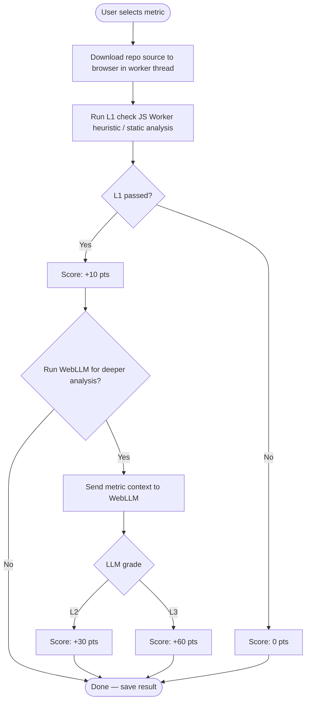

## Scoring History

Julython was started in 2012 and was loosely based on the now defunct National Novel Writing Month which encourages participants to write 50000 words to 'win'. We chose to track scoring by tracking commits via a webhook giving participants 1 point for each commit and 10 points for a new repo added to the game. This was acceptable as a means to track users so if you were playing 'fairly' it was just for your own personal tracking. Just a gentle nudge to keep commiting each day. While this is very easy to track it doesn't really fit with the goal to help people learn and or to actually ship meaningful code.

## What about AI?

As you know A LOT has changed since 2012 and many people are predicting doom and gloom for Software Development industry. While I can't say for certain what the future will be like on a day to day basis, I can say that Software Development best practices and good Software Design are now more important than ever. It doesn't matter if you are physically writing the code or not. What does that mean for Julython?

We actually need to get better at design and documentation in order to develop Software in this new landscape. So in effect we are getting closer to the problem that NaNoWriMo attempted to tackle. You have an idea for some tool or want to get involved in Software Development but the path forward is still very daunting. Sure anyone can prompt Claude to "write a first person shooter game" and it may even produce something you can play. But it won't be great or easy to maintain. You need to constantly prompt the LLM's to fix things or to add new features that of course introduce bugs and/or just break the whole app.

With our new scoring we attempt to address these issues with tracking the health of your project with a few basic metrics. Completing all the metrics themselves will not magically make your software better but it will help you as you work on refactoring your code. The only constant in programming is that things always change, so be prepared.

The best analogy I have heard for the period we are in basically is "Civil Engineers and Architects draw the plans for a new building then hand it off to a team of workers that actually do the work". The main difference with AI is that labor is incredibly fast and cheap. The cost of writing greenfield software is racing to 0 but the costs associated with maintaining it has not changed, and left unchecked will only get worse.

## Why local LLMs are the Key

We care a lot about [your privacy](/privacy) and also don't like giving all our data and IP away to 'Big Tech'. Julython has always been about open-source and that has not changed. AI is changing very rapidly and we hope that much of what we do with cloud models will soon be possible with local models. In fact our scoring is based on how well a WebLLM model can analyze the code. We will not download your code and store it for training on our servers. We don't have any funding and are just doing this for fun too! The analysis is done completely in the browser here is a rough outline:



You don't have to use WebLLM if you don't want to but by using a small model we are basically proving you can analyze the source/docs with a small context model and that model is able to summarize the results correctly. Our thought is if you are able to work with a small model then the large ones will have no trouble at all.

Obviously this is also something that you can easily game so we do want to place some limits on how much you can do. Going forward we are limiting the number of repos per game to 3 and restricting who can update scores for a given project. Only owners of the repo (per github/gitlab) will be able to update analysis for a project.

As the local LLM's get better over time this scoring will change but the best practices will not vary that much. Here are the level one metrics we have defined so far:

1. README

   - Do you have a README and is it substantial
   - Does it have install/getting started instructions
   - Does it have usage instructions
   - Does it have badges like build status

2. Tests

   - Can we find the tests in standard folders aka 'tests'
   - Are there multiple test files
   - Is it using a standard framework that we can run or instructions if not
   - Is test coverage reported

3. CI

   - Are you using a CI
   - Do you have lint/test/build steps

4. Structure

   - Is the code organized properly or documented
   - Is there an ignore file
   - Is there a LICENSE

5. Linting

   - Is linting setup
   - Is pre-commit or similar setup

6. Dependencies

   - Are dependencies defined in a standard file
   - Is dependabot/renovate configured
   - Is there a 'lock' file

7. Documentation

   - Is there a docs folder
   - Is there a CHANGELOG
   - Is there a CONTRIBUTING
   - Is there an ARCHITECTURE document
   - Are there Architecture Discussion Records (ADR)

8. AI Readiness
   - Are there agent rules or AGENTS.md
   - Are the agent rules succinct and broken into multiple docs for longer detail
   - How well can a small model work with your application

These metrics are pretty vague and we will adjust them as we find things that we have not thought of. Level 1 runs completely in your browser with a shallow clone of the repo in memory. This will run in a worker thread so that we can make the files available to the WebLLM for analysis.

For example here is how we might generate a prompt to analyze testing:

```typescript
const SYSTEM_PROMPT = `
You are a testing expert grading a software repository.
Respond with ONLY a JSON object. No explanation. No markdown.

Grade the repository's test quality as L2 or L3:
- L2: Has meaningful tests with reasonable coverage
- L3: Excellent test suite, high coverage, well-structured

{"grade": "L2" | "L3", "reason": "<one sentence>"}`;

interface TestingContext {
  coverage: {
    lines: number; // percentage 0-100
    branches: number;
    functions: number;
  };
  sourceFiles: string[];
  testFiles: string[];
}

function buildTestingPrompt(ctx: TestingContext): string {
  const { coverage, sourceFiles, testFiles } = ctx;
  const testRatio = (
    testFiles.length / Math.max(sourceFiles.length, 1)
  ).toFixed(2);

  return `
Coverage:
    lines=${coverage.lines}%
    branches=${coverage.branches}%
    functions=${coverage.functions}%
Test/source ratio: ${testRatio}

Source: ${sourceFiles.join(", ")}
Tests:  ${testFiles.join(", ")}

Grade this test suite L2 or L3.`;
}

// Usage
const prompt = buildTestingPrompt({
  coverage: { lines: 78, branches: 61, functions: 82 },
  sourceFiles: ["src/game.ts", "src/scorer.ts", "src/repo.ts"],
  testFiles: ["tests/game_test.ts", "tests/scorer_test.ts"],
});
```

Each time you run an analysis we'll update the scores so they will reflect on the game board. The level one checks could change over time and you might drop down. For example we might require a certain amount of code coverage like 70% or test to source ratio of a certain amount. If you push a huge refactor that does not include any tests then those numbers would drop and you'll loose your points.

## But How do I Win?

That is really up to you at this point, if you learn something or make your projects better that is winning in my mind. Of course competition is one major driver so we plan on adding other ways to score points. We don't have any concrete plans at the moment, but some ideas would be bonus points for joining teams or adding features while maintaining L2/L3 metrics.

With any competition there will be cheaters so we'll also be looking at ways to verify the scores are legit. This will probably involve some sort of community effort to police the players who are trying to ruin everyone elses good times.

Stay tuned for more details!
Julython Team
